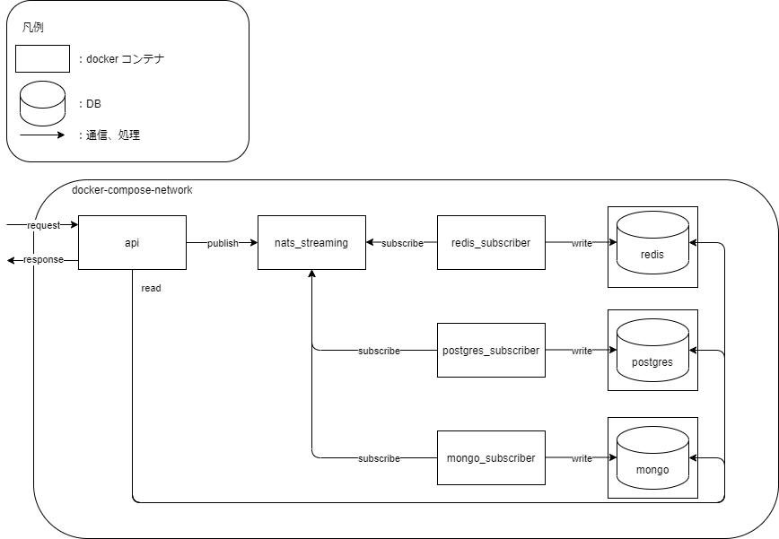
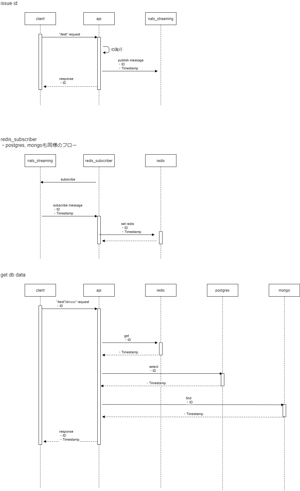

# middleware_test_system

- dockerコンテナを用いて、下記Serviceの動作確認を行います
- apiへの `/test`リクエストでIDを発行、NatsStreaming経由でDBに格納し、`/test?id=xxxx`でDB格納データを確認できます


`/test`

```
{"id":"XXXXXXXX-XXXX-XXXX-XXXX-XXXXXXXXXXXX"}
```

`/test?id=XXXXXXXX-XXXX-XXXX-XXXX-XXXXXXXXXXXX`

```
{"id":"XXXXXXXX-XXXX-XXXX-XXXX-XXXXXXXXXXXX", "type":[{"name":"redis", "timestamp":1616950800000000000},...]}
```

### system diagram



### data flow



### Services

| service             | description                 | port  | other                                 |
| ------------------- | --------------------------- | ----- | ------------------------------------- |
| api                 | issue id & get db data      | 8080  | /test:issue, /test?id=xxx:get db data |
| redis_subscriber    | subscribe & set redis       | -     |                                       |
| postgres_subscriber | subscribe & insert postgres | -     | id:user1,pwd:password                 |
| mongo_subscriber    | subscribe & insert mongo    | -     | id:user1,pwd:password                 |
| nats_streaming      | messaging                   | 4222  |                                       |
| redis               | NoSQL DB(Key-Value)         | 6379  |                                       |
| postgres            | RDB                         | 5432  |                                       |
| mongo               | NoSQL DB(Document)          | 27017 |                                       |
|                     |                             |       |                                       |

### Usage

```
sh docker start.sh

curl localhost:8080/test
curl localhost/test?id=xxxx
```